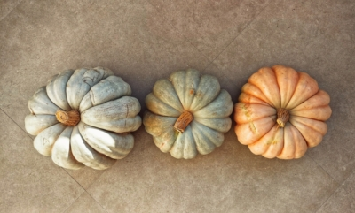
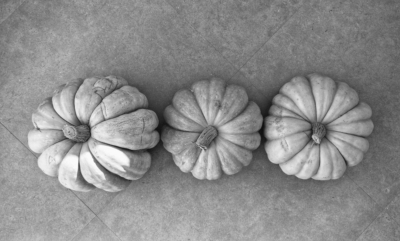
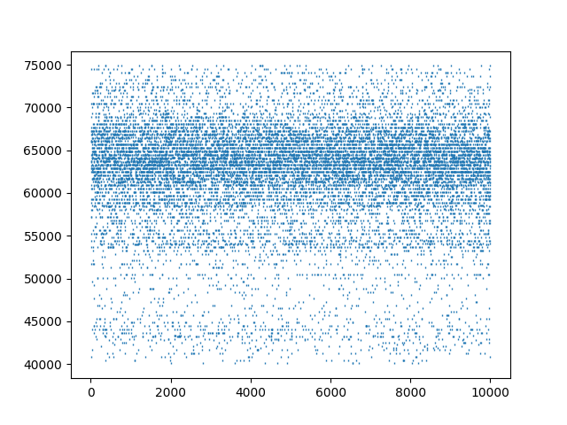

# Convert Images to Poissonian Spikes

Convert your image data to a Poisson spike source to be able to use with Spiking Neural Networks.

<p align="center">
  
  <i>&rarr;</i>
  
  <i>&rarr;</i>
  
</p>


### Requirements
I use Python 3.5.2 on Linux, necessary packages are listed below along with their versions for reference.
* matplotlib (3.0.3)
* numpy (1.17.3)
* opencv-python (4.1.1.26)

Run `pip install -r requirements.txt` to install them all.

### Included Files and Their Usage
```
images-to-spikes/
├── convert_image_to_spike_array.py
├── draw_image.py
├── images
│   ├── cross.png
│   ├── horizontal_line_10x.png
│   ├── horizontal_lines.png
│   └── t10k-images-idx3-ubyte__idx_000__lbl_7_.png
├── poisson_tools.py
└── util_functions.py
```
**convert_image_to_spike_array.py** is the main file. Please see its usage by running it:  `python convert_image_to_spike_array.py`.

**draw_image.py** enables you to draw your own images by adding simple shapes into it via OpenCV. For more information please see the file.

**images** folder contains three of the images that I generated, and one example from MNIST dataset (t10k-images-idx3-ubyte__idx_000__lbl_7_.png).

**poisson_tools.py** is where the Poisson distribution modelling takes place.

**util_functions.py** includes utility functions of files and images.

## References and Citation
I only used the Poissonian spikes approach to obtain spike arrays from images in this project. The original project also contains _Focal Rank Code Order_ approach in this sense.

Please refer to the original project's [Wiki page](https://github.com/NEvision/NE15/wiki) for further information.
